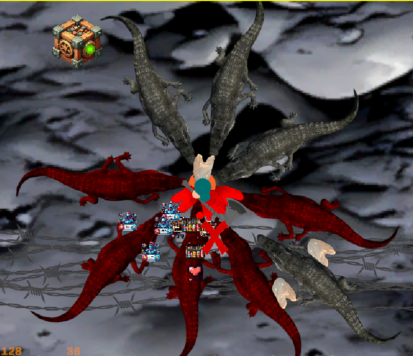
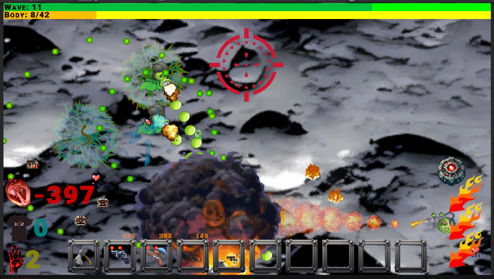

# AAAAAAAA
## popis
Je to hra, 
 
cílem je projít všechny vlny, a porazit bosse, 
 
obsahuje spoustu krokodýlů, 
 
## uvedení do provozu
github nestáhne upscaleovanou fotku povrchu Měsíce,   je třeba ji [zde](https://github.com/Michal-Vrbicky-GitHub/............/blob/main/Assets/Scenes/D/moon-surface-seamless-texture-background-closeup-moon-surface-texture-188679621_upscayl_16x_realesrgan-x4plus-anime.png) stáhnout jako raw file a vložit do Assets\Scenes\D

Kdyby se to chtělo sypat, sestavené exe pro vyzkoušení jsem nahrál [sem](https://www.mediafire.com/file/o5ys5ahit79x2t3/AAAAAAAA.7Z/file).

V tutorialu lze text odstranit klávesou H, jak je napsáno vpravo nahoře.